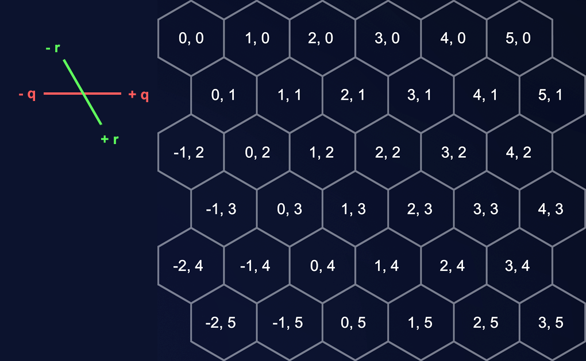

# Implementation

## Implementing the problem domain

The problem the program solves is described in detail in the [project specification](documentation/project_specification.md). To perform pathfinding, it is necessary to define the hex grid, velocity vectors and the coordinate systems to be used for them.

### The hex grid

The hex grid used for pathfinding is defined by specifying the q and r dimensions (as in the above image) in number of hexes. The map is rectangular in shape. It is implemented implicitly: If a given hex is about to be reached by the pathfinding algorithm, the graph object checks if its coordinates lay on the map as defined by its dimensions.

The image depicts a hex grid of the type used by the program: The hex with the coordinate (0,0) is in the upper left. The depicted image has an r and q dimension of 6.

### Coordinate systems

There are two coordinate systems in use: A two-dimensional "axial" coordinate system, where a coordinate is expressed in the form (q,r), and a three-dimensional "cube" coordinate system where a coordinate is expressed in the form (x,y,z). Cube coordinates are used for applications such as vector math as they are conveniently defined by the standard orthogonal basis of a three-dimensional vector space, unlike the axial system where the r-axis is skewed. Technically, cube coordinates could be used everywhere, but since they are difficult to intuitively understand compared to the axial system, I use axial coordinates where possible and convert them to cube coordinates when needed. This is possible as there is a 1:1 relationship between them.

A note: The cube coordinate space here is not the full three-dimensional vector space R3, but a subspace W = {w ∈ W | x + y + z = 0}. In other words, the cube coordinate space is composed of vectors where the sum of all components is zero.

## Program structure

The program is split into the Main, Pathfinder, Data, PerformanceTests and Utility packages.

### Pathfinder

This package contains the core functionality of the program: The class which defines a graph, and all implemented pathfinding algorithms. It uses members of the Data package to depict nodes and coordinates, and relies on the Utility package for vector math and data structures.

Pathfinding is implemented with a generic algorithm which, depending on the heuristic it runs with (if any), functions as either Dijkstra's algorithm or A* with various heuristics. The algorithm uses a minimum heap to pick the next node to process, which uses a comparator to evaluate nodes by the cost on the path to them so far. These comparators house the heuristic that is used in evaluating this cost, and there is one comparator for each heuristic (and Dijkstra's algorithm, which uses no heuristic). Thus, which comparator is used with the algorithm determines what form of Dijkstra's algorithm or A* it actually takes.

### Data

The data package contains the data types used by the program: Graph nodes, the two types of coordinates, and comparators for comparing them.

### PerformanceTests

Includes the code for performance testing, detailed in the testing document.

## Pathfinding algorihtms

There are three variations of the pathfinding algorithm in the program:
- Dijkstra's algorithm, as A* without a heuristic (DIJKSTRA)
- A* with an exact heuristic based on current and goal velocity vector differences (ASTAR_VECTOR)
- A* combining the exact vector heuristic with an inexact but admissible heuristic for remaining time to target (ASTAR_TIME_VECTOR)

## Time and space complexities

The worst case time complexity of the pathfinding algorithm is O(B^d), where B is the number of neighbors of each node and d is the length of the shortest path. B is more or less constantly 7, as the only exceptions are when the neighbors go outside map bounds or exceed the set maximum velocity. In practice, the average time complexity is better for the variants using a heuristic, but I've not performed analysis on this, other than the performance testing results below.

The worst case space complexity is O(n) (where n is the number of nodes in the graph), which is attained when every node is expanded and added to the priority queue. In practice all variations of the algorithm implemented will tend to do better, and the one with heuristics will expand fewer nodes for the same reason they work faster: Their progress is directed towards the goal.

## Performance testing results

Tentative results based on testing with typical pathfinding cases, using the Dijkstra's algorithm implementation as a baseline:
- ASTAR_VECTOR is 2-3 times faster than DIJKSTRA.
- ASTAR_TIME_VECTOR is 6-7 times faster than DIJKSTRA and 2-3 times faster than ASTAR_VECTOR.

More exhaustive analysis would be beneficial.
